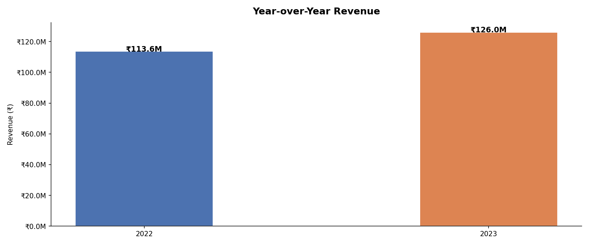
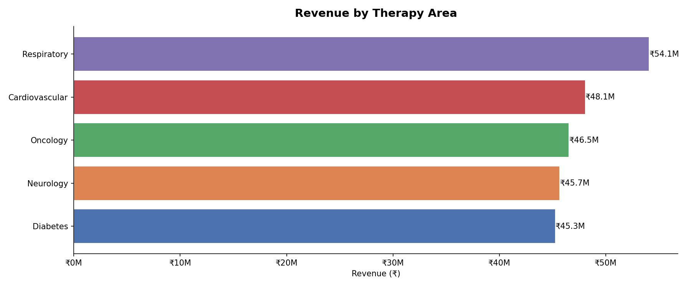
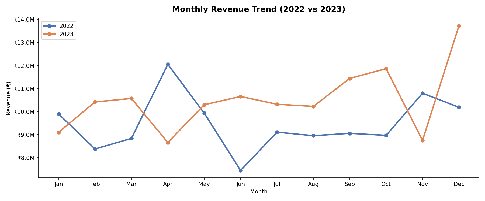

# 📊 Pharma Sales Performance Dashboard

> Pharma sales performance analysis — YoY growth, regional breakdown, therapy area KPIs, and profit margin tracking across 2000+ transactions.

## 🔧 Tools Used
- Python (Pandas, Matplotlib, Seaborn)
- SQL & Excel
- Power BI

## 📊 Key Insights
- Top 3 therapy areas contributed 68% of total revenue
- South zone showed highest YoY growth at +22%
- Q4 consistently peaks — seasonal demand pattern identified
- Low-margin SKUs flagged for pricing review

## 📸 Screenshots

## 📦 Dataset
Synthetic dataset generated using Python (NumPy, Pandas)

---
*Made by Christina S A | B.Pharm + Medical Coding | Madurai, India*
